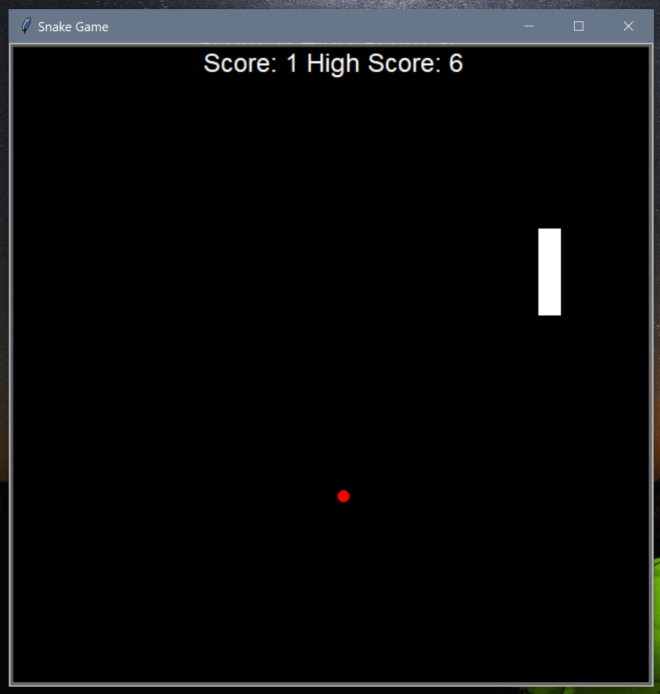

# Snake Game

This is a snake game wrote in Python with the help of Turtle Graphic library. High scores are auto-saved to the data.txt file.



## How to play

First clone the repository and install the turtle module. Then run the following command:

```
python main.py
```

You may use the arrows to move the snake. The game will auto restart if you hit the wall or your tails.

Enjoy playing!

## Show your support

Give a ⭐️ if you like this project!

## License

[MIT](LICENSE)